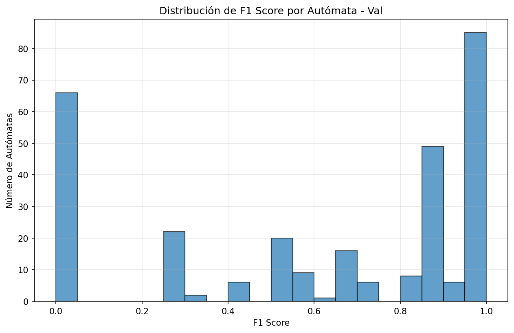
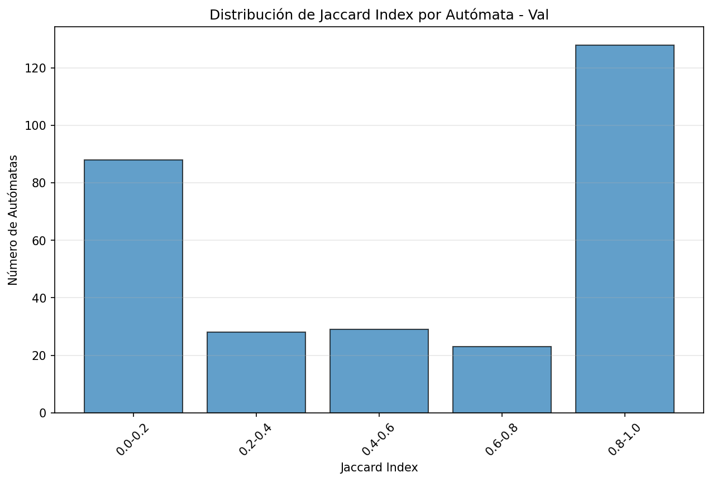
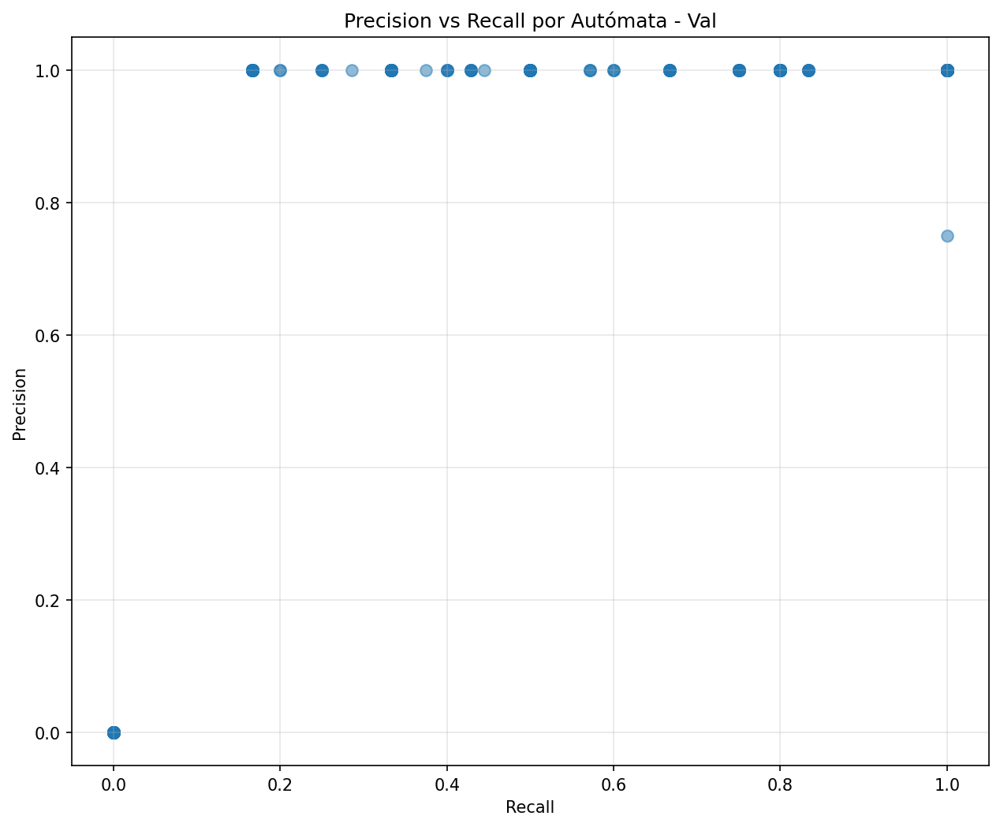
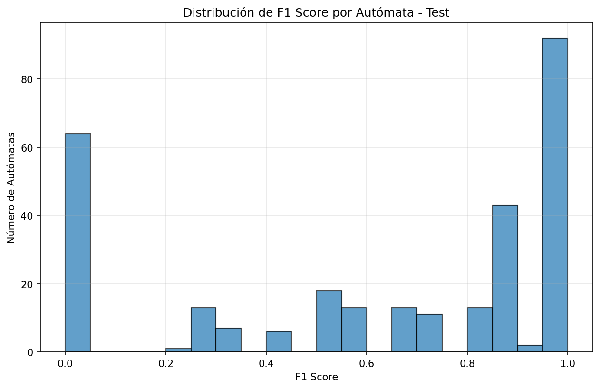
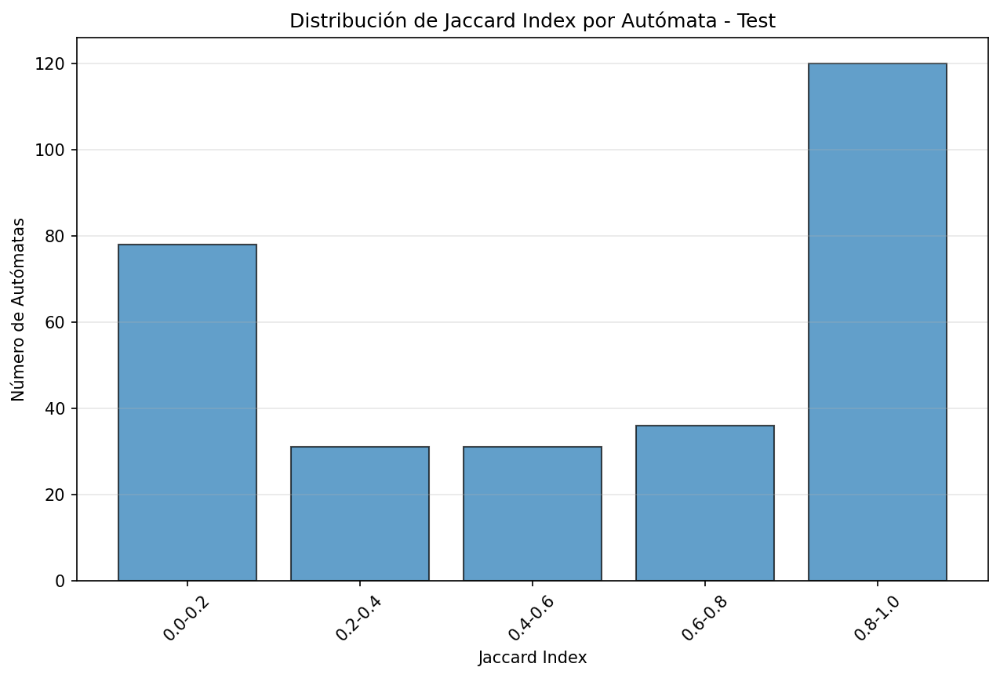
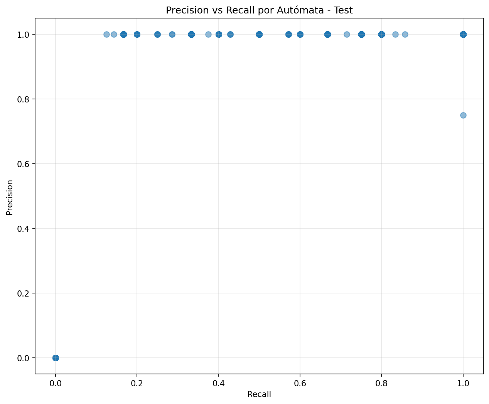

# Reporte A3 - Comparación de Predicciones con Baseline

## Resumen Ejecutivo

Este reporte compara las predicciones del modelo AlphabetNet con el baseline de caracteres observados en cadenas aceptadas (Baseline-2).

## Métricas Agregadas

### Validación

| Métrica | Macro | Micro |
|---------|-------|-------|
| Precision | 0.7762 | 0.9985 |
| Recall | 0.5480 | 0.4989 |
| F1 | 0.6097 | 0.6653 |
| Jaccard | 0.5471 | 0.4985 |
| Tamaño promedio predicho | 2.28 | 674 |
| Tamaño promedio referencia | 4.56 | 1349 |

### Test

| Métrica | Macro | Micro |
|---------|-------|-------|
| Precision | 0.7829 | 0.9985 |
| Recall | 0.5599 | 0.5075 |
| F1 | 0.6217 | 0.6730 |
| Jaccard | 0.5590 | 0.5071 |
| Tamaño promedio predicho | 2.28 | 676 |
| Tamaño promedio referencia | 4.49 | 1330 |

## Curvas de Cobertura

Porcentaje de autómatas con F1 >= threshold:

### Validación

| Threshold | Autómatas | Porcentaje |
|-----------|-----------|------------|
| 0.8 | 148 | 50.00% |
| 0.9 | 91 | 30.74% |
| 0.95 | 85 | 28.72% |

### Test

| Threshold | Autómatas | Porcentaje |
|-----------|-----------|------------|
| 0.8 | 150 | 50.68% |
| 0.9 | 94 | 31.76% |
| 0.95 | 92 | 31.08% |


## Análisis de Errores

### False Positives (Símbolos Sobre-incluidos)

#### Validación

- Total de FP: 1
- Autómatas afectados: 1
- Símbolos más frecuentemente sobre-incluidos:
  - K: 1 veces

#### Test

- Total de FP: 1
- Autómatas afectados: 1
- Símbolos más frecuentemente sobre-incluidos:
  - K: 1 veces

### False Negatives (Símbolos Faltantes)

#### Validación

- Total de FN: 676
- Autómatas afectados: 210
- Símbolos más frecuentemente faltantes:
  - L: 77 veces
  - G: 66 veces
  - K: 66 veces
  - H: 61 veces
  - E: 57 veces

#### Test

- Total de FN: 655
- Autómatas afectados: 203
- Símbolos más frecuentemente faltantes:
  - K: 64 veces
  - L: 62 veces
  - G: 56 veces
  - F: 56 veces
  - H: 56 veces


## Gráficas

### Validación







### Test







## Conclusiones

### Regla de Decisión Utilizada

La regla de decisión utilizada fue:

```

pertenece(s) = (votes[s] >= k_min) AND (max_p[s] >= threshold_s)

```

Con parámetros:

- `k_min = 2` (mínimo número de prefijos que deben votar)

- `threshold_s`: Thresholds por símbolo (0.87-0.93)


### Resultados Principales

- **F1 Macro (Val)**: 0.6097

- **F1 Macro (Test)**: 0.6217

- **F1 Micro (Val)**: 0.6653

- **F1 Micro (Test)**: 0.6730


### Observaciones

1. **Precisión vs Recall**: El modelo tiene alta precisión pero recall moderado, lo que indica que es conservador en sus predicciones.

2. **Tamaño de alfabetos**: Las predicciones tienen tamaño promedio ~2.28 símbolos, mientras que el baseline tiene ~4.5 símbolos, confirmando que el modelo es conservador.

3. **Errores**: Los falsos negativos son más comunes que los falsos positivos, lo que es consistente con un modelo conservador.

4. **Generalización**: Las métricas en test son similares o ligeramente mejores que en validación, indicando buena generalización.


### Recomendaciones

1. **Ajustar thresholds**: Reducir los thresholds por símbolo podría mejorar el recall sin sacrificar demasiado la precisión.

2. **Ajustar k_min**: Reducir `k_min` de 2 a 1 podría capturar más símbolos.

3. **Análisis de errores**: Investigar por qué ciertos símbolos son frecuentemente faltantes o sobre-incluidos.
